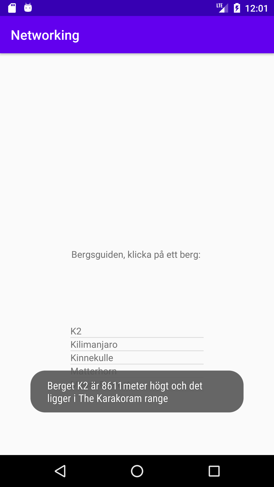

# Uppdatering rapport dugga 6:
Appen är nu uppdaterad med kod som är mer städad än den första inlämningen som blev underkänd på tilvägagångssättet för att lösa uppgiften.
Koden är nu mer städad och riskerar inte att slösa med ramminne på samma sätt som tidigare.
Efter en avskalning av koden och bortplockandet av en medlemsvariabel städades även koden i onPostExecute.
```
@Override
        protected void onPostExecute(String json) {
            Log.d("TAG", json); //Inspekterer jsonfilen från nätet
            Gson gson = new Gson();
            Mountain[] mountains = gson.fromJson(json, Mountain[].class);
            mountainsListan.clear();

            for(int i = 0; i < mountains.length; i++) {
                Log.d("Shottabalulu", "onPostExecute: Berget heter " + mountains[i].getName());
                mountainsListan.add(mountains[i]);
            }

            adapter.notifyDataSetChanged();
        }
```
I onPostExecute skapas gson objektet som sedan används för att hämta data från jsonfilen i den tilldelade url:en och lagrar i mountains.
Innan vi därefter kliver in i for-loopen rensas mountinsListan, inte för att det i detta läget egentligen är nödvändigt men för att få
med tänket att det kan vara nödvändigt. Skulle en knapp eller annat finnas som skulle kunna användas för att mata in informationen så
behöver informationen också rensas någonstans för att därefter uppdateras med den nya informationen. En bonus med andra ord i detta läget
som är bra att känna till.
Vid nästa steg träder vi in i forloopen som skriver ut namnen på de olika bergen till loggen. Därefter laddas mountainListan med informationen
från mountains då alla positioner där itereras igenom.
Till sist då vi träder ur for-loopen talar funktionen notifyDataSetChanged() om för adapter att det finns uppdaterad information att skriva
ut till listview som sedan kommer utföras högre upp i dokumentet i onCreate.

# Rapport dugga 6 Network Mats Läth
Dugga 6 var en stor utmaning att lösa. Till att börja med gjordes en återgång till dugga tre för att öva på materialet där
med att hantera arrayer och skriva ut dessa i en toast. Dock är det en lokal array som hanteras och i dugga sex är det
en Json array genom en url som ska hanteras.

För att lösa arbetet med json arrayen genom en url så skapades en egen klass som i detta fallet heter Mountain.java. I MainActivity.java
skapas sedan en adapter som kopplar json arrayens url till appen genom JsonTask().extends som plockar in arrayen genom dess url och
detta hanteras i det som i undervisningsmaterialet har benämnts vid "Nätverkskoden".

För att lösa uppgiften har delar lärts in som att ett objekt är vad en klass kallas för då den kallas på och används och det som ligger bakom
ett objekt för att ett objekt ska kunna existera krävs en klass.
Tex skapas här ett objekt som heter adapter som länkar in i klassen Mountain:
```
adapter = new ArrayAdapter<Mountain>(this,R.layout.listatext,R.id.textView2, mountainsListan);
```
För att adapter ska kunna användas överallt deklareras den innan direkt under klassen MainActivity som en global medlemsvariabel
för att kunna användas överallt i dokumentets alla metoder:
```
private ArrayAdapter<Mountain> adapter;
```

För att lösa uppgiften har tre nya filer skapats som används i uppgiften. Två filer som är klasser, en klass som heter Mountain.java som har beskrivits tidigare
men även en fil som heter AuxData.java. Klassen som skapats AuxData.java används för att lösa ut hela arrayen som levereras genom url:en till uppgiften. AuxData ligger som ett eget
objekt i objektet med berg och måste därför få en egen klass för att lösa ut den informationen till appen.

Den tredje filen som skapats är layout filen listatext.xml som är laddad med en textview vilken tar emot informationen från arrayen som sedan laddas in till listview i filen
activity_main.xml dessa kopplingar sker genom MainActivity.java i funktionen:
```
 @Override
        protected void onPostExecute(String json) {
            Log.d("TAG", json);
            Gson gson = new Gson();
            mountains = gson.fromJson(json, Mountain[].class);
            adapter.notifyDataSetChanged();         //Fram hit uppdateras bara listan i ramminnet
            adapter = new ArrayAdapter<Mountain>(MainActivity.this,R.layout.listatext,R.id.textView2, mountains);
            my_listview.setAdapter(adapter);
 ```
 Då objektet Mountain anropas för utskrift kommer defaultvärdet att skriva ut det som angetts i funktionen toString() i fallet med den här appen returneras värdet som finns i arrayen vid name.
 ```
  @Override
    public String toString() {
        return name;
    }
 ```
Det som ger själva utskriften till listview genom MainActivity.java är den här koden i funktionen här ovanför i onPostExecute
```
adapter = new ArrayAdapter<Mountain>(MainActivity.this,R.layout.listatext,R.id.textView2, mountains);
            my_listview.setAdapter(adapter)
```
Utskriften till toast sker genom
```
    @Override
    protected void onCreate(Bundle savedInstanceState) {
        super.onCreate(savedInstanceState);
        setContentView(R.layout.activity_main);
        new JsonTask().execute("https://wwwlab.iit.his.se/brom/kurser/mobilprog/dbservice/admin/getdataasjson.php?type=brom");
        adapter = new ArrayAdapter<Mountain>(this,R.layout.listatext,R.id.textView2, mountainsListan); //Skapar objeket
        my_listview = (ListView) findViewById(R.id.listans_id);   //Skapar referensen tänk ungefär som pekare i C++

        my_listview.setAdapter(adapter); //Här läggs JsonTask skörden in till listan

        my_listview.setOnItemClickListener(new AdapterView.OnItemClickListener() {
            @Override
            public void onItemClick(AdapterView<?> parent, View view, int position, long id) {
                Toast.makeText(getApplicationContext(), "Berget " + mountains[position] + " är " + mountains[position].getSize() + "meter högt och det ligger i "+ mountains[position].getLocation(), Toast.LENGTH_SHORT).show();
            }
        });
    }
```
Närmare bestämt den delen av koden som ligger inom metoden onItemClick är den vackra magin som ger sluttouchen till att välja ut vad som ska skrivas ut i toasten,
```
Toast.makeText(getApplicationContext(), "Berget " + mountains[position] + " är " + mountains[position].getSize() + "meter högt och det ligger i "+ mountains[position].getLocation(), Toast.LENGTH_SHORT).show();
```
För att korrekt data i relation till var användaren har klickat ska skrivas ut används position. Att position används innebär att den delen som användaren har klickat på i listan kommer även att skickas  
med in i funktionen med toast. Maskineriet fungerar på det sättet att allt vi hanterar är ju vad som kan liknas vid en array och position anger vilken position i arrayen vi är på. Alltså 0 1 2 osv.  
Som nämnt tidigare att defaultvärdet då något ska skrivas ut från en klass ligger i funktionen toString, och i toString anges name vilket innebär att bergets namn kommer att visas. Därför skriver:
```
mountains[position]
```
bergets namn. Ett steg längre för att kunna skriva ut annat ur arrayen krävs följande:
```
mountains[position].getLocation()
```
detta kommer att använda sig av en getter i klassen Mountain.
```
public String getLocation() {return location;}
```

# Tack till Jimmy
Jag vill i rapporten belysa den pedagogiska hjälp Jimmy i vår webug20familj har skänkt mig!
Utan Jimmys handledning hade jag i skrivande stund sannolikt stått handfallen med uppgiften
i dugga 6. Jimmy har på ett systematiskt och inspirerande sätt hjälpt mig lösa de problem
som uppstått, tex då kod inte gått att hantera på samma sätt som i guider eftersom ibland  
har kod blivit uppdaterad där inte guiderna och instruktioner hunnits med.
Jimmys finurliga sätt att lämna "fällor" vilka han gett mig verktyg att kunna lösa har
varit mycket elegant.
Stort tack Jimmy!


